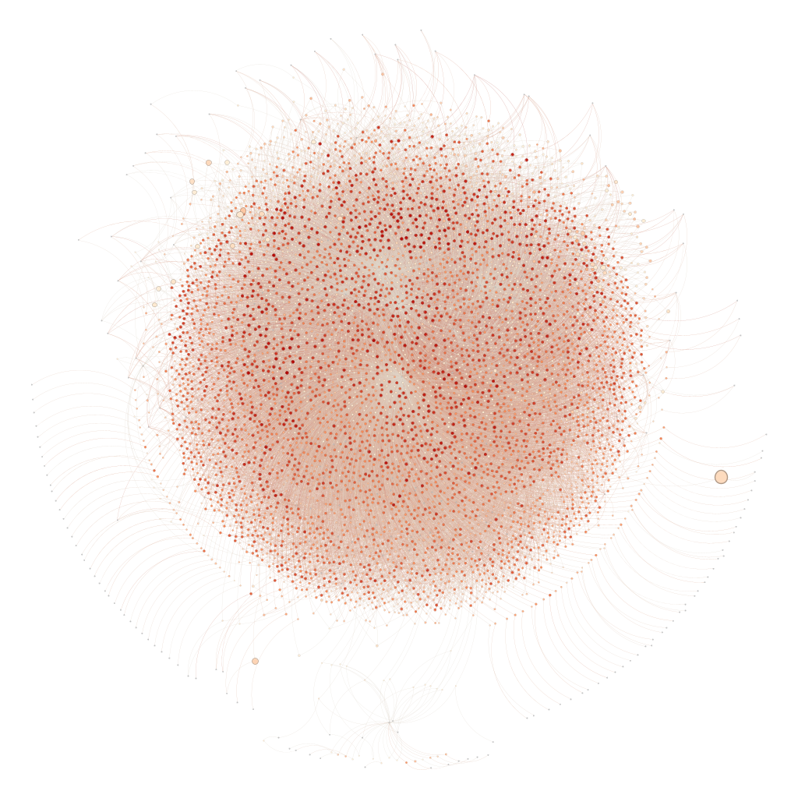

# MarketingAnalyticsProject 🎓
This is the repository of the Marketing Analytics project work held by Professor Lucio Lamberti in A.Y. 2022/2023. The goal of the project was to analyze transactions of large retail users with the aim of finding actionable and valuable insights.<br/>
This is the structure of the folder:
```

```
<p align="center">

</p>

